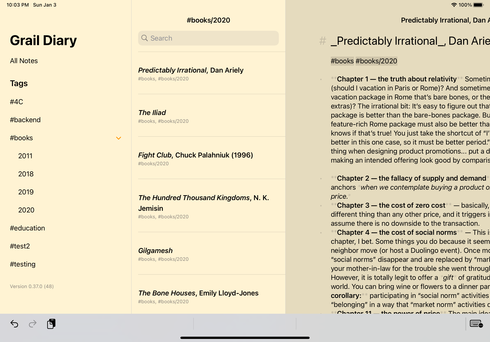

# Grail Diary

Grail Diary is an iOS notes app inspired by [*Commonplace Books*](https://en.wikipedia.org/wiki/Commonplace_book) -- places where to record thoughts and quotes about the things you read. Grail Diary is not for quick, transient, *scrap paper* notes. It's a place to write things that will be meaningful to you for a long time.

> A commonplace book is a central resource or depository for ideas, quotes, anecdotes, observations and information you come across during your life and didactic pursuits. The purpose of the book is to record and organize these gems for later use in your life, in your business, in your writing, speaking or whatever it is that you do. (Ryan Holiday, [*How and Why to Keep a "Commonplace Book"](https://ryanholiday.net/how-and-why-to-keep-a-commonplace-book/)).

What makes Grail Diary different from other notes apps is its *review mode*. Review mode scans your notes for quotes, prompt questions, and [cloze deletions](https://en.wikipedia.org/wiki/Cloze_test). It prompts you with this material to make sure you constantly refresh your memory with all of the great things you've been capturing.

## The Basics

* Grail Diary is a pure client app. There's no service, no accounts, no passwords, and you always own your data.
* Runs on the iPad or iPhone and requires iOS 14. (Creating notes works best with an iPad and a keyboard, but reviewing your notes works great on an iPhone.)
* Notes are plain text with Markdown formatting.
* All of your Grail Diary notes are stored in a single file that you can synchronize across your devices with the system of your choice (e.g., iCloud or DropBox). iCloud Document Storage works great for keeping your notes in sync across multiple devices.
* Organize notes with hashtags. You can use hierarchical hashtags, too (e.g., `#books/2021`).
* Fast full-text search.

